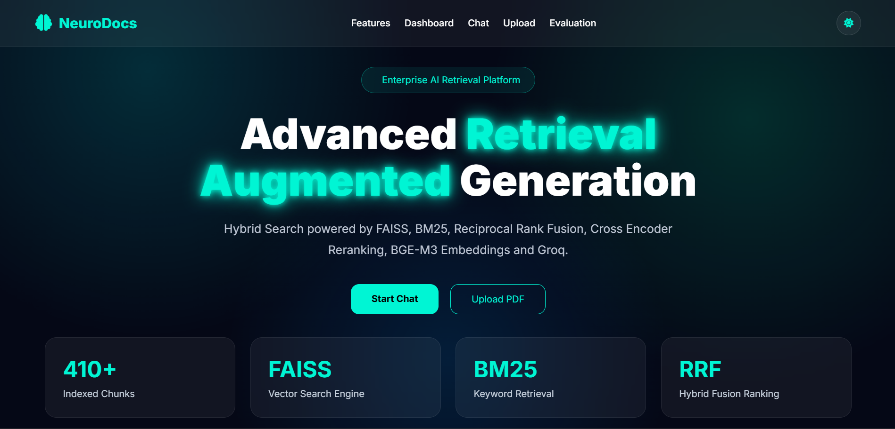
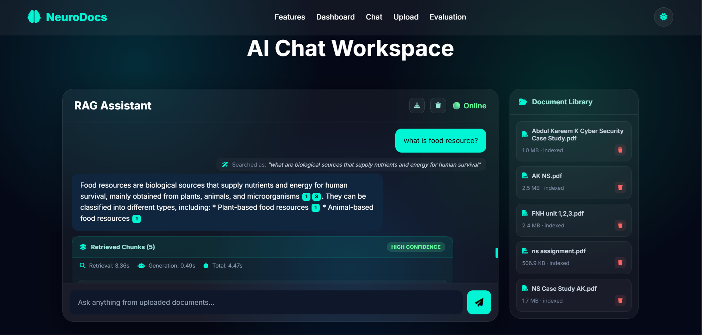
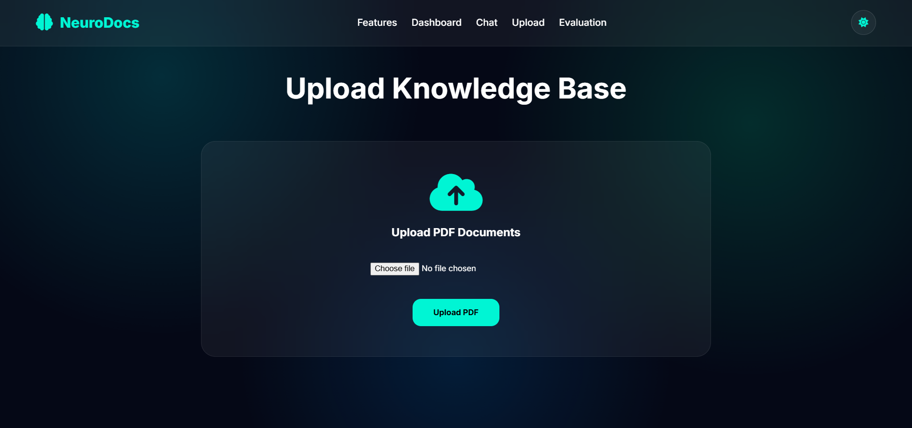
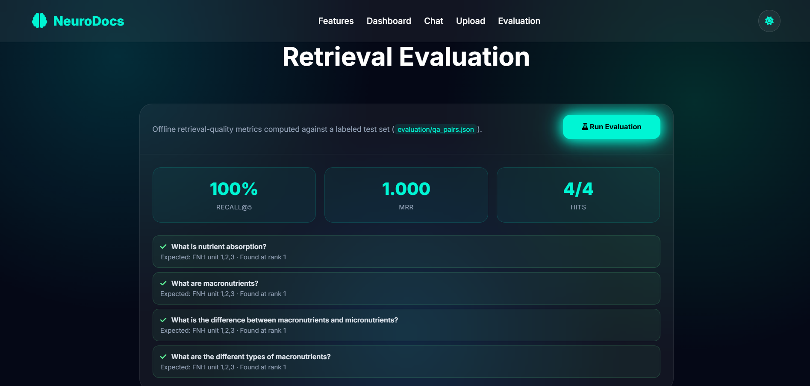
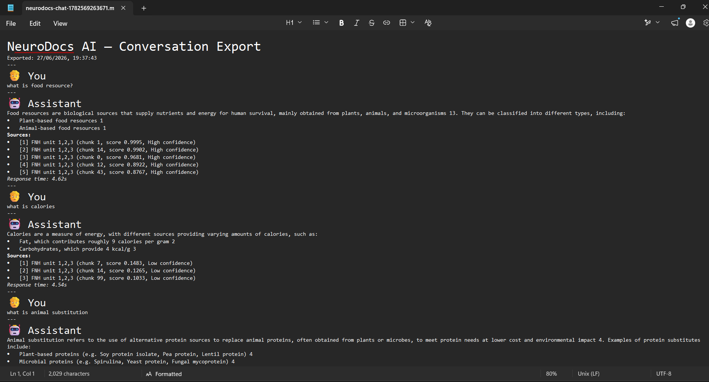

# NeuroDocs AI

[](https://www.python.org/)
[](https://fastapi.tiangolo.com/)
[](LICENSE)
[](https://groq.com/)

**Author:** Abdul Kareem K — [GitHub @AK2005-Git](https://github.com/AK2005-Git)

> **Production-grade Hybrid Retrieval-Augmented Generation system** combining dense vector search, sparse keyword retrieval, reciprocal rank fusion, and cross-encoder reranking — with query rewriting, hallucination detection, and confidence-aware routing layered on top of a cloud LLM. Served through a FastAPI backend with a fully custom web UI.

---

## Why This Project Exists

Most "RAG tutorial" projects stop at *upload a PDF, ask a question, get an answer*. That pipeline looks impressive for about ten seconds — until you ask it something the document doesn't cover, and it confidently makes something up anyway. That gap between "looks like it works" and "is actually trustworthy" is the real, unsolved problem in applied RAG systems today, and it's the problem this project is built around.

NeuroDocs AI exists to answer a more honest question: **not just "can this retrieve and generate an answer," but "can this system tell me when it doesn't actually know"?**

Concretely, that means:

- **Hybrid retrieval** (dense + sparse + fusion + reranking) so the system finds relevant context whether the question is conceptual or keyword-specific.
- **Query rewriting** so vague or follow-up questions ("what about its causes?") get resolved into something retrieval can actually act on.
- **Groundedness checking** so an answer that isn't actually supported by the retrieved context gets flagged — instead of presented with the same confidence as a well-supported one.
- **Confidence-aware routing** so low-confidence or empty results produce an honest "I'm not sure" with next steps, rather than a guess dressed up as fact.
- **A real evaluation harness** (Recall@K, MRR against a labeled test set) so retrieval quality is a measured number, not a feeling.

This is the difference between a RAG *demo* and a RAG *system* — and that difference is the entire point of this project.

---

## Architecture

```
┌──────────────────────────────────────────────────────────────┐
│                      INGESTION PIPELINE                      │
│                                                              │
│   PDF Upload → PyMuPDF → Chunker → BGE-M3 Embeddings         │
│                                    ↓              ↓          │
│                                 FAISS           BM25         │
│                              (dense idx)    (sparse idx)     │
└──────────────────────────────────────────────────────────────┘
                                ↓
┌──────────────────────────────────────────────────────────────┐
│                        QUERY PIPELINE                        │
│                                                              │
│   User Question                                              │
│        ↓                                                     │
│   Query Rewriting (LLM resolves pronouns, fixes vague querie)│
│        ↓                          ↓                          │
│   FAISS Search                BM25 Search                    │
│        ↓                          ↓                          │
│         └──────── RRF Fusion ─────┘                          │
│                      ↓                                       │
│           Cross-Encoder Reranker                             │
│                      ↓                                       │
│           Top-K Context Chunks                               │
│                      ↓                                       │
│              Groq LLM (generation + citations)               │
│                      ↓                                       │
│        Groundedness Check (is the answer actually supported?)│
│                      ↓                                       │
│        Confidence-Aware Routing (normal / low-confidence /   │
│                  no-results / unsupported)                   │
│                      ↓                                       │
│                  Final Answer + Sources                      │
└──────────────────────────────────────────────────────────────┘
```

---

## Features

### Retrieval
- **Hybrid Retrieval** — combines semantic (FAISS dense) and lexical (BM25 sparse) search
- **Reciprocal Rank Fusion (RRF)** — merges ranked lists from both retrievers without requiring score normalization
- **Cross-Encoder Reranking** — fine-grained relevance scoring on the fused candidate set
- **BGE-M3 Embeddings** — multilingual, multi-granularity dense embeddings
- **Adjustable Retrieval Settings** — live UI toggle between Hybrid / FAISS-only / BM25-only, adjustable Top-K, reranking on/off

### Reliability & Trust
- **Query Rewriting** — vague or context-dependent questions are rewritten into clear, standalone search queries before retrieval runs
- **Hallucination / Groundedness Detection** — a second LLM pass checks whether the generated answer is actually supported by the retrieved context
- **Confidence-Aware Routing** — low-confidence answers, empty results, and unsupported claims are flagged with an explicit warning and actionable suggestions, rather than presented as fact
- **Inline Citations** — answers cite retrieved chunks as `[1]`, `[2]`, etc., clickable to jump straight to the source chunk

### Product & UX
- **PDF Upload & Management** — drag-and-drop ingestion, real document library synced with the backend, full delete-and-reindex support
- **Persistent Chat History** — conversations (including citations, retrieval panels, and routing banners) survive a page reload
- **Conversation Export** — download the full chat as a clean Markdown file
- **Light / Dark Theme** — toggle, preference saved across sessions
- **Live Stats Dashboard** — running query count, average response time, document count, and last-answer confidence, updating in real time

### Measurability
- **Evaluation Dashboard** — runs a labeled QA test set through the real retrieval pipeline and reports Recall@K and Mean Reciprocal Rank (MRR), both in the UI and via API

### Infrastructure
- **FastAPI Backend** — async REST API with automatic OpenAPI docs at `/docs`
- **Cloud LLM via Groq** — fast, free-tier inference; no local GPU/RAM-heavy LLM server required to deploy
- **Modular Pipeline** — chunker, embedder, retriever, reranker, and LLM layer are independently swappable

---

## Screenshots

> Screenshots live in `docs/screenshots/` and render automatically on GitHub.

### Homepage


### Chat Interface (Citations + Retrieval Panel)


### Upload Interface & Document Library


### Evaluation Dashboard


### Conversation Export


---

## Project Structure

```
NeuroDocs-AI/
│
├── api/
│   └── upload.py               # PDF upload, document listing, document delete
│
├── data/                       # Raw PDFs, extracted text, chunks, indexes (git-ignored)
├── docs/
│   └── screenshots/            # README screenshots
│
├── evaluation/
│   ├── qa_pairs.json           # Labeled test questions for retrieval evaluation
│   ├── run_eval.py             # Computes Recall@K and MRR against qa_pairs.json
│   └── last_run_results.json   # Most recent evaluation run (generated, git-ignored)
│
├── frontend/
│   ├── app.js                  # Chat logic, citations, retrieval panel, settings,
│   │                           # history, eval dashboard, theme toggle
│   ├── index.html              # Single-page application shell
│   └── style.css               # Full styling, light/dark themes
│
├── ingestion/
│   ├── chunker.py               # Text chunking
│   ├── embedder.py / embedding.py  # BGE-M3 embedding generation
│   ├── pdf_loader.py            # PyMuPDF-based text extraction
│   └── rebuild_pipeline.py      # Re-index all documents from scratch
│
├── memory/                      # Conversation memory
├── analytics/                   # Query count / usage stats
│
├── retrieval/
│   └── advanced_search.py       # FAISS + BM25 + RRF + reranking, adjustable settings
│
├── tests/                       # Unit and integration tests
│
├── main.py                      # FastAPI app, all API endpoints
├── rag_chat.py                  # Core RAG orchestration: rewriting, retrieval,
│                                 # generation, groundedness check, routing
├── requirements.txt
├── .env.example                 # Required environment variables (placeholder only)
├── .gitignore
├── LICENSE
└── README.md
```

---

## Prerequisites

| Requirement | Version | Notes |
|-------------|---------|-------|
| Python | ≥ 3.10 | 3.11+ recommended |
| Groq API key | — | Free, no credit card — [console.groq.com](https://console.groq.com/keys) |
| RAM | ≥ 8 GB | For local embedding + reranker models |
| Disk | ≥ 5 GB | For embedding/reranker model weights + indexes |

> This project no longer requires a local LLM server. Embeddings (BGE-M3) and reranking run locally; **generation runs via the Groq API**, which is why no GPU or 16GB+ RAM is required just to chat.

---

## Installation

```bash
# 1. Clone the repository
git clone https://github.com/AK2005-Git/NeuroDocs-AI.git
cd NeuroDocs-AI

# 2. Create and activate a virtual environment
python -m venv venv
source venv/bin/activate          # Windows: venv\Scripts\activate

# 3. Install dependencies
pip install --upgrade pip
pip install -r requirements.txt
```

> **First run:** BGE-M3 and the cross-encoder reranker (~1.5 GB combined) download automatically from HuggingFace Hub on first launch.

---

## Configuration

Copy the example environment file and add your Groq API key:

```bash
cp .env.example .env
```

```env
# Required
GROQ_API_KEY=your_groq_api_key_here

# Optional (defaults to llama-3.3-70b-versatile)
GROQ_MODEL=llama-3.3-70b-versatile
```

Get a free Groq API key at [console.groq.com/keys](https://console.groq.com/keys) — no credit card required.

**Never commit your real `.env` file.** It's already excluded in `.gitignore`.

---

## Running the System

```bash
uvicorn main:app --reload
```

Open the UI:

```
http://127.0.0.1:8000/ui
```

Watch the startup log for:

```
Groq API key: loaded OK
```

If you instead see a warning, your `.env` file isn't in the project root or isn't named exactly `.env`.

---

## API Reference

Interactive docs are auto-generated by FastAPI at `/docs` and `/redoc`.

| Method | Endpoint | Description |
|--------|----------|--------------|
| `POST` | `/chat` | Send a question, receive an answer with sources, citations, routing, and timing |
| `POST` | `/upload` | Upload and ingest a PDF |
| `GET` | `/documents` | List all currently indexed documents |
| `DELETE` | `/documents/{filename}` | Remove a document and rebuild the index without it |
| `GET` | `/evaluation/results` | Get the most recent evaluation run |
| `POST` | `/evaluation/run` | Run the evaluation suite live against `qa_pairs.json` |
| `GET` | `/health` | Health check |
| `GET` | `/info` | Project metadata and feature list |

**Example — Chat with adjustable settings:**

```bash
curl -X POST http://localhost:8000/chat \
  -H "Content-Type: application/json" \
  -d '{
    "question": "What are macronutrients?",
    "retrieval_mode": "hybrid",
    "top_k_final": 5,
    "use_reranker": true,
    "enable_query_rewrite": true,
    "enable_groundedness_check": true
  }'
```

**Example — Delete a document:**

```bash
curl -X DELETE "http://localhost:8000/documents/example.pdf"
```

---

## How It Works

### 1. Ingestion
1. `pdf_loader.py` extracts raw text from each page using PyMuPDF.
2. `chunker.py` splits text into overlapping chunks.
3. `embedder.py` encodes every chunk with **BGE-M3** into dense vectors.
4. Vectors go into a **FAISS** flat index; raw text is indexed in parallel for **BM25**.

### 2. Query Rewriting
Before retrieval, the question (plus recent conversation history) is passed to the LLM, which resolves pronouns, fixes vague phrasing, and outputs a standalone search query. Already-clear, detailed first-turn questions skip this step to save latency.

### 3. Retrieval
- **FAISS** returns top-K dense matches.
- **BM25** returns top-K sparse/keyword matches.
- **RRF** fuses both ranked lists: `score = Σ 1 / (rrf_k + rank + 1)`.
- The **cross-encoder reranker** scores the fused candidates and returns the final top-K — unless reranking is disabled in settings, in which case fused rank order is used directly.

### 4. Generation & Citation
The reranked, numbered context chunks are injected into a prompt sent to **Groq**. The model is instructed to cite the specific source number (`[1]`, `[2]`, etc.) after any claim drawn from that chunk.

### 5. Groundedness Check
A second, narrower LLM call checks whether the generated answer is actually supported by the retrieved context, returning `GROUNDED` or `UNSUPPORTED` (with a short explanation if unsupported).

### 6. Confidence-Aware Routing
The final response is routed into one of four states:
- `normal` — top retrieval confidence is high enough, answer is grounded
- `low_confidence` — best match score is below threshold; user gets rephrasing suggestions
- `no_results` — nothing passed the minimum relevance threshold at all
- `unsupported` — the groundedness check flagged the answer as not fully supported by context

---

## Evaluation

```bash
python evaluation/run_eval.py --dataset evaluation/qa_pairs.json --top-k 5
```

This runs every labeled question in `qa_pairs.json` through the **real retrieval pipeline** and reports:

- **Recall@K** — what fraction of questions had a relevant source in the top-K results
- **MRR (Mean Reciprocal Rank)** — how high up the first relevant result tended to rank

Results are also viewable live in the UI under the **Evaluation** tab, or via `GET /evaluation/results` / `POST /evaluation/run`.

> `evaluation/qa_pairs.json` ships with placeholder questions — replace them with real questions and the exact filenames of documents you've uploaded for a meaningful evaluation.

---

## Troubleshooting

| Symptom | Likely Cause | Fix |
|---------|-------------|-----|
| `GroqError: api_key client option must be set` | `.env` missing or misnamed | Confirm a file named exactly `.env` (not `.env.example`) exists in the project root with `GROQ_API_KEY=...` |
| Startup shows the `GROQ_API_KEY not found` warning | `.env` not loaded | Confirm `main.py` has `load_dotenv()` at the very top, before other imports |
| `ModuleNotFoundError: faiss` | Package not installed | `pip install faiss-cpu` |
| `ModuleNotFoundError: groq` | Package not installed | `pip install groq` |
| Retrieved chunks panel looks cut off | Stale cached CSS | Hard refresh (`Ctrl+Shift+R`) |
| Chat box narrow on first load, wide after first question | Stale cached CSS (conflicting width rules, now fixed) | Hard refresh (`Ctrl+Shift+R`) |
| Empty answers / "no relevant information found" | Document not actually indexed, or threshold too strict | Check the Document Library shows the file; try a more specific question |
| Deleting a document feels slow | Expected — delete triggers a full index rebuild | Wait for "Deleting and rebuilding index..." to finish |

---

## Roadmap

- [x] Hybrid retrieval (FAISS + BM25 + RRF)
- [x] Cross-encoder reranking
- [x] Query rewriting
- [x] Hallucination / groundedness detection
- [x] Confidence-aware routing
- [x] Inline citations
- [x] Adjustable retrieval settings panel
- [x] Evaluation dashboard (Recall@K, MRR)
- [x] Document delete + real document library
- [x] Persistent chat history + export
- [x] Light/dark theme

---

## License

```
MIT License

Copyright (c) 2026 Abdul Kareem K

Permission is hereby granted, free of charge, to any person obtaining a copy
of this software and associated documentation files (the "Software"), to deal
in the Software without restriction, including without limitation the rights
to use, copy, modify, merge, publish, distribute, sublicense, and/or sell
copies of the Software, and to permit persons to whom the Software is
furnished to do so, subject to the following conditions:

The above copyright notice and this permission notice shall be included in all
copies or substantial portions of the Software.

THE SOFTWARE IS PROVIDED "AS IS", WITHOUT WARRANTY OF ANY KIND, EXPRESS OR
IMPLIED, INCLUDING BUT NOT LIMITED TO THE WARRANTIES OF MERCHANTABILITY,
FITNESS FOR A PARTICULAR PURPOSE AND NONINFRINGEMENT. IN NO EVENT SHALL THE
AUTHORS OR COPYRIGHT HOLDERS BE LIABLE FOR ANY CLAIM, DAMAGES OR OTHER
LIABILITY, WHETHER IN AN ACTION OF CONTRACT, TORT OR OTHERWISE, ARISING FROM,
OUT OF OR IN CONNECTION WITH THE SOFTWARE OR THE USE OR OTHER DEALINGS IN THE
SOFTWARE.
```

---

<p align="center">
  Built with BGE-M3 · FAISS · BM25 · RRF · Cross-Encoder · Groq · FastAPI
</p>